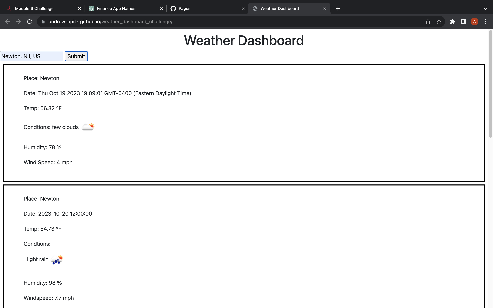

# weather_dashboard_challenge
[LiveSite](https://andrew-opitz.github.io/weather_dashboard_challenge/)

## Description
This website was created to get and show current and future weather forecasts for a given area. The site prompts the user for a city then uses data from OpenWeatherMapAPI to show the forecast.

## Installation
N/A

## Usage

## Credits
N/A

## License
Please refer to the license in the repo.